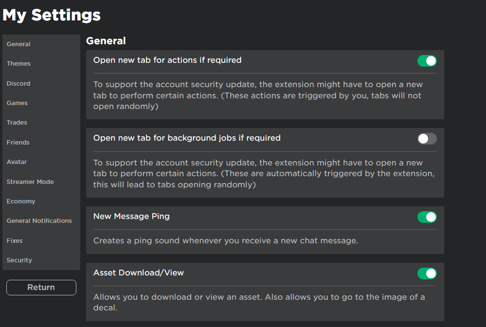
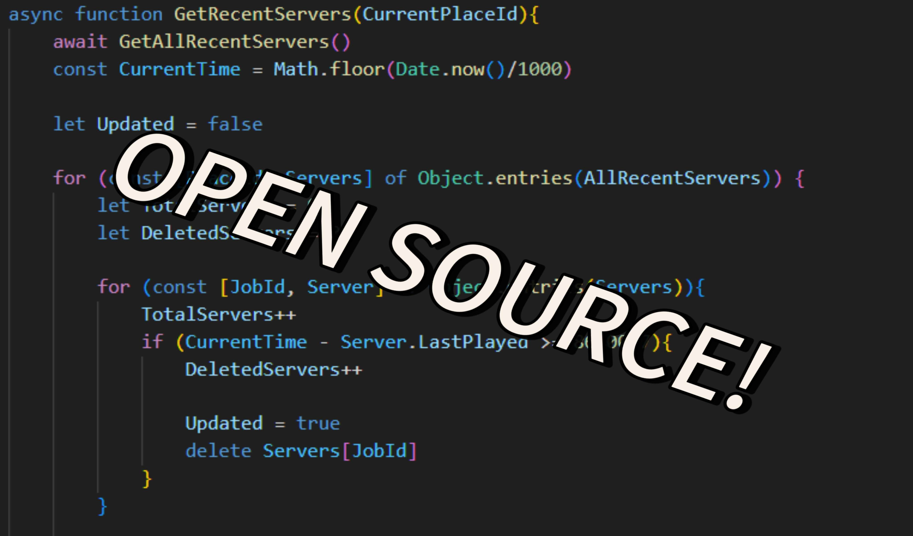
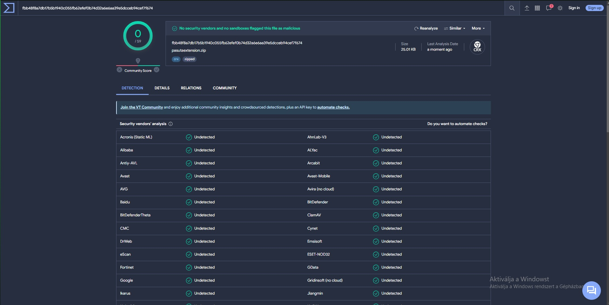

# Our Extension

## Description
My Awesome Extension is a powerful tool that enhances your browsing experience in Roblox.

## Features
- Easy installation process
- Customizable settings
- User-friendly interface
- Regular updates and bug fixes

## How to Install
1. Open your web browser.
2. Navigate to the extensions page.
3. Enable the developer mode.
4. Drag the "pasutaextension3.0.1.zip" in the extenions.
5. Congratulations! The extension is now installed.

## How to Use
1. Once installed, you will see the extension icon in the browser toolbar.
2. Click on the extension icon to open the main menu.
3. Customize the settings according to your preferences.
4. Enjoy!

## Screenshots

## FAQ
- **Is Our Extension free to use?**
  Yes, our Extension is completely free to use for all users.

- **Is Our Extension safe?**
  Yes, you can check it at the screenshots or our website:"https://pasuta.000webhostapp.com/extension.html".
- **Does Our Extension collect any personal data?**
  No, our Extension does not collect any personal data or browsing history.

- **Is Our Extension available for mobile devices?**
  No, its a pc only Extension

## Support
For any inquiries or assistance, please contact our support team at https://discord.gg/pasuta.

## License
This project is licensed under the MIT License - see the [LICENSE.md](LICENSE.md) file for details.
